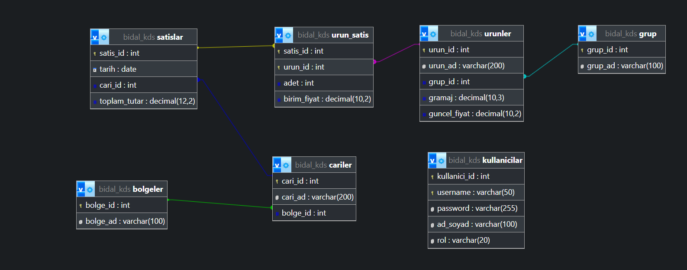

# Bidal KDS - Karar Destek Sistemi

Bu proje, veriye dayalı kararlar almayı kolaylaştırmak amacıyla geliştirilmiş, React ve Node.js tabanlı modern bir web uygulamasıdır.

## Proje Hakkında

Bidal KDS, kullanıcıların satış verilerini analiz etmesini, stok takibi yapmasını sağlayan bir Karar Destek Sistemidir. Kullanıcı dostu arayüzü ve güçlü backend mimarisi ile performanslı bir deneyim sunar.

## 🛠️ Teknolojiler

Bu proje aşağıdaki teknolojiler kullanılarak geliştirilmiştir:

**Frontend (İstemci):**
* **React:** UI kütüphanesi (Vite ile build edilmiştir)
* **Tailwind CSS:** Stil ve tasarım
* **JavaScript (ES6+):** Temel programlama dili

**Backend (Sunucu):**
* **Node.js:** Sunucu çalışma ortamı
* **Express.js:** Web sunucusu framework


* **Models:** Veritabanı şemaları ve veri yapısı.
* **Views:** React kullanıcı arayüzü (Frontend).
* **Controllers:** İş mantığı ve API fonksiyonları.
* **Routes:** API uç noktaları ve yönlendirmeler.

## ⚙️ Kurulum ve Çalıştırma

Projeyi yerel makinenizde çalıştırmak için aşağıdaki adımları izleyin:

### Ön Gereksinimler
* Node.js (v14 veya üzeri)
* npm veya yarn

### Adımlar

1.  **Repoyu klonlayın:**
    ```bash
    git clone [https://github.com/kullaniciadi/bidal-kds.git](https://github.com/kullaniciadi/bidal-kds.git)
    cd bidal_kds_final
    ```

2.  **Bağımlılıkları yükleyin:**
    ```bash
    npm install
    ```

3.  **Projeyi başlatın (Development):**
    ```bash
    # Backend ve Frontend'i aynı anda başlatmak için (eğer ayarlıysa)
    npm run dev
    
    # Veya sadece frontend için
    npm run vite
    ```

    ## 📋 İş Kuralları ve Senaryolar

Proje kapsamında veri bütünlüğünü korumak için aşağıdaki 2 özel senaryo uygulanmıştır:

1.  **Güvenli Ürün Silme:** `DELETE /api/urun-sil`
    * **Kural:** Bir ürün silinmek istendiğinde sistem önce geçmiş satış kayıtlarını kontrol eder. Eğer ürün daha önce satılmışsa, muhasebe kayıtlarının bozulmaması için silme işlemine izin verilmez.
    
2.  **Fiyat Kontrolü:** `PUT /api/urun-guncelle`
    * **Kural:** Ürün fiyat güncellemelerinde negatif veya 0 değeri girilmesi engellenmiştir.

## 🔌 API Endpoint Listesi

| Metot | Endpoint | Açıklama |
| :--- | :--- | :--- |
| POST | `/api/login` | Kullanıcı girişi ve JWT üretimi |
| GET | `/api/sezon-trendi` | Aylık ciro verilerini çeker |
| GET | `/api/urun-analiz` | Ürün satış ve tahmin verileri |
| GET | `/api/cari-analiz` | Müşteri risk ve VIP raporu |
| PUT | `/api/urun-guncelle` | Ürün fiyatını günceller (İş kurallı) |
| DELETE | `/api/urun-sil` | Ürünü siler (İş kurallı) |

